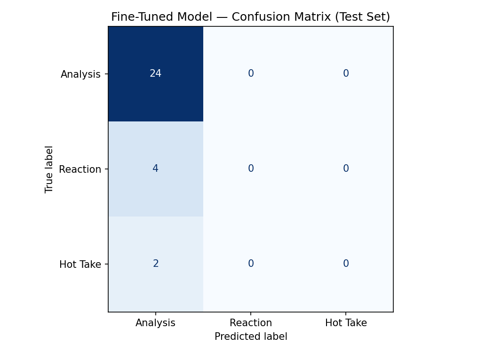

# AI201 Project 3 - TakeMeter

## Project Overview

TakeMeter is a text classification project that analyzes discourse in the r/formula1 Reddit community. The goal is to classify Formula 1 comments into one of three categories:

- Analysis
- Reaction
- Hot Take

Rather than determining whether a comment is correct or incorrect, the classifier attempts to identify the style of discussion being used.

## Community Description

I selected r/formula1 because it contains a diverse mix of technical race analysis, emotional reactions, and controversial opinions. Discussions regularly include race strategy, driver comparisons, championship predictions, team criticism, and reactions to major Formula 1 events.

This variety makes the community a good candidate for a classification task because different styles of discourse are common and meaningful to community members.

## Labels

### Analysis

Comments that support claims using evidence, technical reasoning, race strategy discussion, regulations, statistics, or detailed explanations.

Example:

> Ferrari lost track position because they pitted after the tire crossover window.

### Reaction

Comments that primarily express emotion, excitement, frustration, humor, or immediate personal reactions.

Example:

> Ferrari ruined another race weekend. Pain.

### Hot Take

Strong opinions, predictions, or controversial claims with little supporting evidence.

Example:

> Lando Norris will never win a Formula 1 championship.

## Dataset

- Source: r/formula1
- Total examples: 274
- Labels:
  - Analysis
  - Reaction
  - Hot Take

Examples were collected from public Formula 1 discussions and manually reviewed before final inclusion.

## Model

### Baseline

Zero-shot classification using Groq llama-3.3-70b-versatile.

### Fine-Tuned Model

DistilBERT, using `distilbert-base-uncased`, was fine-tuned on the labeled dataset.

Training configuration:

- Epochs: 3
- Learning rate: 2e-5
- Batch size: 16

## Evaluation Report

### Overall Accuracy

| Model | Accuracy |
|---|---:|
| Zero-Shot Baseline | 46.34% |
| Fine-Tuned DistilBERT | 46.34% |

| Metric | Value |
|---|---:|
| Accuracy Gain | 0.00 percentage points |

The fine-tuned model achieved the same overall accuracy as the zero-shot baseline. Although fine-tuning helped the model begin separating Analysis and Reaction comments, it did not successfully learn the Hot Take category.

## Baseline Per-Class Metrics

| Label | Precision | Recall | F1 |
|---|---:|---:|---:|
| Analysis | 0.78 | 0.47 | 0.58 |
| Reaction | 0.37 | 0.77 | 0.50 |
| Hot Take | 0.40 | 0.15 | 0.22 |

| Metric | Value |
|---|---:|
| Accuracy | 46.3% |
| Macro F1 | 0.44 |
| Weighted F1 | 0.44 |

## Fine-Tuned Per-Class Metrics

| Label | Precision | Recall | F1 |
|---|---:|---:|---:|
| Analysis | 0.44 | 1.00 | 0.61 |
| Reaction | 0.57 | 0.31 | 0.40 |
| Hot Take | 0.00 | 0.00 | 0.00 |

| Metric | Value |
|---|---:|
| Accuracy | 46.3% |
| Macro F1 | 0.34 |
| Weighted F1 | 0.35 |

## Evaluation Against Success Criteria

The model did not meet the success criteria established during the planning phase.

Planned goals:

- Accuracy ≥ 75%
- F1 ≥ 0.70 for each label
- Fine-tuned model outperforming the baseline by at least 10 percentage points
- No label with an F1 score below 0.60

Actual results:

- Baseline accuracy: 46.3%
- Fine-tuned accuracy: 46.3%
- Analysis F1: 0.61
- Reaction F1: 0.40
- Hot Take F1: 0.00

The model failed to reach the planned accuracy target and did not improve over the baseline. The largest issue was the inability to correctly identify Hot Take comments. However, the evaluation process revealed useful information about label ambiguity and class imbalance, which are important lessons for future classification projects.

## Confusion Matrix



| True Label | Predicted Analysis | Predicted Reaction | Predicted Hot Take |
|---|---:|---:|---:|
| Analysis | 15 | 0 | 0 |
| Reaction | 9 | 4 | 0 |
| Hot Take | 10 | 3 | 0 |

The model correctly classified all 15 Analysis examples in the test set. However, it only correctly classified 4 Reaction examples and never predicted Hot Take. The main failure pattern is that Hot Take comments were classified as Analysis or Reaction instead of Hot Take.

This confusion matrix reveals that the model learned to separate Analysis and Reaction to some extent, but it failed to learn the Hot Take category. The largest source of error was predicting Analysis when the true label was Hot Take.

## Failure Analysis

Before writing this section, I used ChatGPT to identify common patterns in the model's mistakes. The main pattern was that the model struggled with comments that contained Formula 1 terminology but did not provide real evidence.

### Failure 1: Hot Take Classified as Analysis

Example:

> Ferrari strategy has always been terrible.

True label: Hot Take  
Predicted label: Analysis

This is a Hot Take because it makes a broad unsupported claim. The model likely predicted Analysis because the comment contains the word "strategy," which often appears in real analytical comments.

### Failure 2: Reaction Classified as Analysis

Example:

> I can't believe Ferrari messed that up again.

True label: Reaction  
Predicted label: Analysis

This is mainly an emotional response. The model appears to focus more on the Formula 1 topic than on emotional language.

### Failure 3: Hot Take Classified as Reaction

Example:

> Championship back on.

True label: Hot Take  
Predicted label: Reaction

This is a short prediction with little context. The model struggled because short comments do not provide enough evidence to clearly separate prediction from emotional reaction.

## Sample Classifications

| Comment | Predicted Label | Confidence |
|---|---|---:|
| Ferrari lost track position because they pitted too late. | Analysis | N/A |
| What a race! | Reaction | N/A |
| Norris will never win a title. | Reaction | N/A |

Confidence scores were not exposed by the evaluation notebook and therefore are reported as N/A.

## Reflection

The intended goal of the project was to distinguish between evidence-based analysis, emotional reactions, and controversial opinions within Formula 1 discussions.

The final model learned Analysis much more effectively than the other categories. The confusion matrix showed that the model predicted Analysis for all Analysis examples and most Hot Take examples. As a result, Hot Take achieved an F1 score of 0.00 because the model never predicted that category.

This suggests that the model learned Formula 1 topic-related language more strongly than the discourse structure represented by the labels. Comments containing strategy, drivers, teams, or race terminology were frequently classified as Analysis even when they were actually opinions or predictions.

One lesson from this project is that creating clear label boundaries is more difficult than expected. Many Formula 1 comments contain both opinion and reasoning, making the distinction between Analysis and Hot Take difficult for both humans and the model. Future work would focus on collecting more examples of Hot Take comments and refining the definitions to reduce overlap between categories.

## Spec Reflection

### How the Spec Helped

The planning document helped define the labels before annotation began. This made it easier to decide whether a comment should be labeled as Analysis, Reaction, or Hot Take.

### How the Implementation Diverged

The original plan aimed for a balanced dataset. In practice, many r/formula1 comments were either informational or emotional, while clear Hot Take examples were harder to collect. Because of this, the dataset required extra review and rebalancing attempts.

## AI Usage

### Label Design

ChatGPT was used during the planning phase to refine the label definitions and generate edge-case examples. I reviewed and adjusted these suggestions before adding them to the project documentation.

### Annotation Assistance

ChatGPT helped with preliminary labeling of Formula 1 comments. I reviewed the labels and made changes where the suggested label did not match the project definitions.

### Failure Analysis

ChatGPT was used to help identify patterns in misclassified examples. I manually reviewed the patterns before including them in this README.

## Repository Structure

```text
ai201-project3-takemeter/
│
├── README.md
├── planning.md
├── labeled_dataset.csv
├── evaluation_results.json
└── confusion_matrix.png

## Demo Video

The demo video shows: https://github.com/andynguyen01/ai201-project3-takemeter.git

1. Several Formula 1 comments being classified by the fine-tuned model.
2. One correct prediction with explanation.
3. One incorrect prediction with explanation.
4. A brief walkthrough of the evaluation report and confusion matrix.